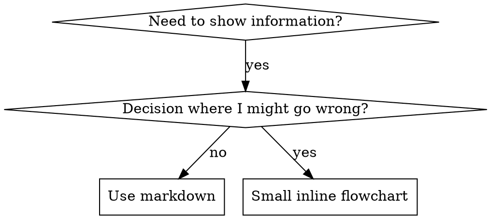

# Writing Skills

## Overview

**Writing skills IS Test-Driven Development applied to process documentation.**

You write a test (a pressure scenario run by a subagent), watch it fail (baseline behavior without the skill), write the skill (documentation that addresses the specific failures), watch the test pass (subagent now complies), and refactor (close loopholes the subagent finds).

**Core principle:** If you didn't watch an agent fail without the skill, you don't know if the skill teaches the right thing.

**Required background:** This skill assumes the RED-GREEN-REFACTOR cycle from `testing-discipline`. Read that first if you haven't internalised TDD — the same discipline applies to documentation.

**Companion documents in this skill:**
- `anthropic-best-practices.md` — Anthropic's official skill-authoring guide. Covers progressive disclosure, conciseness, runtime architecture, and a complete checklist. Read before authoring your first skill.
- `persuasion-principles.md` — Cialdini-based research on why authority/commitment/scarcity language works on LLMs. Read before hardening a discipline skill.
- `testing-skills-with-subagents.md` — Pressure-scenario testing methodology, rationalisation tables, meta-testing. Read before deploying any discipline skill.
- `graphviz-conventions.dot` — Style guide for `dot` flowcharts inside skills.
- `render-graphs.js` — Utility that renders the `dot` blocks in a SKILL.md to SVG.
- `examples/CLAUDE_MD_TESTING.md` — Worked example of a test campaign.

## What is a Skill?

A **skill** is a reference guide for a proven technique, pattern, or tool. Skills help future agent instances find and apply effective approaches.

**Skills are:** reusable techniques, patterns, tools, reference guides.

**Skills are NOT:** narratives about how you solved a problem once.

## TDD Mapping for Skills

| TDD concept | Skill creation |
|-------------|----------------|
| Test case | Pressure scenario with a subagent |
| Production code | Skill document (`SKILL.md`) |
| Test fails (RED) | Subagent violates the rule without the skill |
| Test passes (GREEN) | Subagent complies with the skill present |
| Refactor | Close new loopholes while staying compliant |
| Write test first | Run the baseline scenario BEFORE writing the skill |
| Watch it fail | Document the exact rationalisations the subagent uses |
| Minimal code | Write the skill addressing only those specific violations |
| Watch it pass | Verify the subagent now complies |
| Refactor cycle | Find new rationalisations → plug → re-verify |

The entire skill creation process follows RED-GREEN-REFACTOR.

## When to Create a Skill

**Create when:**
- A technique wasn't intuitively obvious — you or an agent got it wrong first.
- You'd reference this again across projects.
- The pattern applies broadly (not project-specific).
- Others would benefit from the encoded process.

**Don't create for:**
- One-off solutions to a specific problem.
- Standard practices well-documented elsewhere.
- Project-specific conventions — put those in `.context/standards/` instead.
- Mechanical constraints enforceable with linting or validation — automate those, save skills for judgment calls.

## Skill Types

| Type | Description | Examples |
|------|-------------|----------|
| **Technique** | Concrete method with steps | `systematic-debugging`, `initialize-repo` |
| **Discipline** | Rules that prevent known failure modes | `testing-discipline`, `verification-checklist` |
| **Pattern** | Way of thinking about problems | `design-first`, `migration-planning` |
| **Reference** | API docs, syntax guides, tool documentation | `commit-discipline`, `code-quality-rules` |
| **Format** | Output templates with structure guidance | `jira-story`, `rfc` |

Discipline skills need the most hardening — see *Bulletproofing Discipline Skills* below.

## Where Skills Live

The destination determines who loads the skill — choose it before building the folder structure.

| Scope | Path | Distribution |
|-------|------|--------------|
| **Plugin skill** | `<plugin-repo>/skills/<skill-name>/` — for ICON authoring, `skills/<skill-name>/` at the plugin repo root; installed consumers see it at `plugins/icon/skills/<skill-name>/` | Loaded in every repo that installs the plugin |
| **Repo-level skill** | `<repo-root>/.claude/skills/<skill-name>/` | Loaded only when working in that specific repo |
| **User-level skill** | `~/.claude/skills/<skill-name>/` | Loaded in every Claude Code session for that user, across all repos |

**Decision rule:**
- **Plugin skill** — useful to any consumer of the plugin; ships automatically when the plugin is installed.
- **Repo-level skill** — agent-facing technique that applies only within one repo (maintainer tooling, release automation, repo-specific operational procedures). For repo-specific *conventions or rules* (style, naming, branching), use `.context/standards/` instead — see "Don't create for" above.
- **User-level skill** — personal preference or workflow that has no relationship to any specific repo.

**Worked example from this repo:**

`release-plugin` lives at `.claude/skills/release-plugin/` — it automates publishing the ICON plugin itself. No consumer of ICON needs it; only ICON maintainers do. Repo-level is correct.

`writing-skills` is authored at `skills/writing-skills/` in this plugin source repo and ships to consumers as `plugins/icon/skills/writing-skills/` after install. Plugin-level is correct.

A personal skill like `my-draft-style` that controls only your own writing preferences belongs at `~/.claude/skills/my-draft-style/` — no repo should load it automatically.

When intent is unclear, start narrower (user → repo → plugin) and promote on demand.

## Directory Structure

```
skills/
  skill-name/
    SKILL.md              # Main reference (required)
    supporting-file.*     # Only if needed (heavy reference, reusable tools)
    examples/             # Worked examples (optional)
```

**Keep inline:** principles, concepts, code patterns under 50 lines, examples.
**Separate files for:** heavy reference (100+ lines), reusable scripts/templates, large worked examples.

### Self-Contained Skill

```
defense-in-depth/
  SKILL.md
```

Use when all content fits inline.

### Skill with Reusable Tool

```
condition-based-waiting/
  SKILL.md
  example.ts
```

Use when the tool is reusable code, not just narrative.

### Skill with Heavy Reference

```
pptx/
  SKILL.md
  pptxgenjs.md   # 600 lines API reference
  ooxml.md       # 500 lines XML structure
  scripts/
```

Use when reference material is too large for inline.

## SKILL.md Structure

### Frontmatter (YAML)

```yaml
---
name: skill-name-with-hyphens
description: >
  Use when [specific triggering conditions and symptoms]
user-invocable: false   # set to true if invokable via /<skill-name>
---
```

- **`name`** — Letters, numbers, hyphens only. Verb-first gerunds work well (`writing-skills`, `executing-plans`). 64-character maximum.
- **`description`** — Third person. Starts with "Use when…". Describes ONLY triggering conditions — never the workflow. 1024-character maximum.
- **`user-invocable`** — ICON-specific. `true` for skills exposed as `/<skill-name>` slash commands.

**Always use the YAML folded block scalar form (`description: >`) — never a plain scalar.** Plain scalars break on `: ` (colon + space) and `[…]` characters that frequently appear in real descriptions ("Note: …", inline tag examples like `[NgWi]`). The block form treats those characters as literal and prevents silent skill-loader parse failures.

### Why description must NOT summarise workflow

Testing has shown that when a description summarises a skill's workflow, agents follow the description instead of reading the full skill. A description saying "code review between tasks" caused an agent to do ONE review even though the flowchart in the skill body clearly showed TWO reviews. Removing the workflow summary fixed it.

```yaml
# BAD: summarises workflow — agent may follow this instead of reading the skill
description: >
  Use for TDD - write test first, watch it fail, write minimal code, refactor

# BAD: too abstract / first person
description: For async testing
description: I can help you with async tests

# GOOD: triggering conditions only
description: >
  Use when writing tests, reviewing test quality, or deciding what to mock
```

Describe the PROBLEM or TRIGGER, not the SOLUTION.

### Body Skeleton

```markdown
# Skill Name

## Overview
Core principle in 1-2 sentences. What is this and why does it matter?

## When to Use
Bullet list of symptoms and situations.
When NOT to use.

## The Process (or Core Pattern)
The actual technique, steps, or rules.
Before/after comparisons for techniques.

## Common Mistakes
What goes wrong and how to fix it.

## Rationalization Prevention (for discipline skills)
Table of excuses agents make and why they're wrong.
```

Not every skill needs every section. Scale to complexity — a simple technique skill might be 40 lines; a discipline skill might be 150. Keep SKILL.md under 500 lines; split into supporting files past that.

### Step and Phase Heading Format

When a skill defines a numbered process, prefix every step or phase heading with the skill name:

```markdown
## skill-name: Step 1: Do Something       ← correct
## skill-name: Phase 2: Verify            ← correct
## Step 1: Do Something                   ← wrong — agent cannot tell which skill this belongs to
```

When a skill has sub-processes (stages that contain steps), include both stage and step identifiers — this is the canonical path through the process:

```markdown
## skill-name: Stage 1: Prepare
### skill-name: Stage 1: Step 1: Do X     ← correct — full path preserved
### skill-name: Stage 1: Step 2: Do Y     ← correct
## skill-name: Stage 2: Execute
### skill-name: Stage 2: Step 1: Do Z     ← correct

### Stage 1: Step 1: Do X                 ← wrong — missing skill name
### skill-name: Step 1: Do X              ← wrong — ambiguous which stage this belongs to
```

The full path (`skill-name: Stage N: Step N`) lets an agent reading a heading in isolation know which skill, stage, and step it is at — without scrolling back. This prevents agents from confusing skill steps with task-plan steps when both appear in the same context window.

### Editing an Existing Numbered Skill

When you insert, remove, or reorder steps in an already-numbered skill, keep the skill internally consistent — the pre-commit hooks do not catch numbering or structure drift:

- **Renumber every cross-reference (ICON-0078).** After inserting a step and shifting the rest, `grep` every `Step N` mention — prose, tables, "proceed to Step N", end-of-step summaries — and update each. A dangling "see Step 8" that now means Step 9 is invisible to the hooks and only caught by review.
- **Match the skill's own structure (ICON-0077).** Borrow a sibling skill's *content*, but follow THIS skill's existing heading/list format — don't add `##`-headed steps to a skill whose Process is a flat numbered list, even if a sibling uses `##`.

## Discoverability

Future agents find your skill through the `using-skills` catalogue and description matching. Optimise for discovery.

**1. Rich description** — Include symptoms, error patterns, and contexts that would trigger use.

**2. Keyword coverage** — Use words agents would search for:
- Error messages: "Hook timed out", "ENOTEMPTY", "race condition"
- Symptoms: "flaky", "hanging", "timeout", "pollution"
- Synonyms: "timeout/hang/freeze", "cleanup/teardown/afterEach"
- Tools: actual commands, library names, file types

**3. Descriptive naming** — Verb-first, active voice:
- `commit-discipline` not `git-commit-guidelines`
- `design-first` not `pre-implementation-review`
- `context-maintenance` not `context-directory-updates`
- Gerunds (`-ing`) work well for processes: `creating-skills`, `testing-skills`, `debugging-with-logs`.

**4. Register the skill** — After creating a skill:
- Add it to the skills table in `README.md`.
- If the skill participates in a multi-skill sequence, document the sequence in the consuming agent's workflow section (manager Workflow Orchestration, product-manager Workflow).

## Token Efficiency

Skills load into context on demand, but every word in a loaded skill costs tokens that compete with conversation history.

**Targets:**
- Frequently-loaded skills: aim for < 200 words.
- Standard skills: aim for < 500 words.
- Complex discipline skills: can go longer, but earn every line.

**Techniques:**

Move details to tool help instead of documenting flags:

```bash
# BAD: document all flags in SKILL.md
search-conversations supports --text, --both, --after DATE, --before DATE, --limit N

# GOOD: reference --help
search-conversations supports multiple modes and filters. Run --help for details.
```

Cross-reference instead of duplicating workflow details:

```markdown
# BAD: repeat the workflow
[20 lines copy-pasted from another skill]

# GOOD: reference the other skill
Always use subagents (50–100x context savings). REQUIRED: see `using-skills` for workflow.
```

Compress examples — show the pattern, not the novel. Eliminate redundancy.

**Verification:**

```bash
wc -w skills/path/SKILL.md
```

## Cross-Referencing Other Skills

Use the skill name only, with explicit requirement markers:

- ✅ `**REQUIRED BACKGROUND:** Read testing-discipline before applying this skill.`
- ✅ `See systematic-debugging for the full process.`
- ❌ `See skills/testing/test-driven-development` (path-coupled, brittle).
- ❌ `@skills/testing/SKILL.md` (force-loads on read, burns context, only works in some agents).

**Why no `@` links:** in some runtimes the `@` prefix force-loads a file the moment the surrounding text is read, consuming context before you need it. Plain references let agents fetch the file only when they decide they need to.

**Skills must be self-contained.** A skill cannot rely on resources or files that live outside its own directory — there is no portable cross-skill resource mechanism that works across every agent runtime. If you need shared content, copy it into the skill that needs it, or reference it as a sibling skill that the agent will load explicitly.

**Reference standards and `.context/` docs by NAME too, never by literal path (ICON-0076).** The same by-name rule extends to standards and other `.context/` docs a skill cites (e.g. "see the secure-coding standard", not a literal `.context/standards/<doc>.md` path). For ICON-local docs this is mechanically required, not just stylistic: a literal `.context/` path in skill content trips the pre-commit dead-`.context/`-reference gate, which expects a `context_template/` mirror — and an ICON-local/untemplated standard has none. Reach for the gate's exemption marker only for genuinely transient refs; for a permanent live-doc reference the correct fix is by-name, which matches this convention and sidesteps the gate with no marker to maintain. The marker IS correct, though, for `.context/` paths that are conditionally-generated OUTPUT or consumer-only and by design never exist in `context_template/` (ICON-0077 — e.g. a verify checklist citing `overview.md`/`projects.md`/`domains/` that a generator may or may not emit); narrow such a marker to exclude paths that ARE templated and resolve. Marker = conditionally-generated/consumer-only paths; by-name = permanent live-doc refs.

## Flowchart Usage



**Use flowcharts ONLY for:**
- Non-obvious decision points.
- Process loops where you might stop too early.
- "When to use A vs B" decisions.

**Never use flowcharts for:**
- Reference material → tables, lists.
- Code examples → markdown blocks.
- Linear instructions → numbered lists.
- Labels without semantic meaning (`step1`, `helper2`).

See `graphviz-conventions.dot` for graphviz style rules.

**Visualising for the user:** `render-graphs.js` in this directory renders a skill's `dot` blocks to SVG:

```bash
./render-graphs.js ../some-skill           # each diagram separately
./render-graphs.js ../some-skill --combine # all diagrams in one SVG
```

Requires graphviz (`dot`) installed locally.

## Code Examples

**One excellent example beats many mediocre ones.** Choose the most relevant language for the technique. Don't implement in five languages.

**Good examples are:**
- Complete and runnable.
- Commented explaining WHY (not what).
- From realistic scenarios.
- Ready to adapt.

**Avoid:**
- Fill-in-the-blank templates.
- Contrived examples that don't match real use.
- Multi-language dilution.

## The Iron Law

```
NO SKILL WITHOUT A FAILING TEST FIRST
```

This applies to NEW skills AND EDITS to existing skills.

Write skill before testing? Delete it. Start over.
Edit skill without testing? Same violation.

**No exceptions:**
- Not for "simple additions".
- Not for "just adding a section".
- Not for "documentation updates".
- Don't keep untested changes as "reference".
- Don't "adapt" while running tests.
- Delete means delete.

The same iron law from `testing-discipline` applies here. The medium changed; the discipline didn't.

## Testing All Skill Types
Different skill types need different test approaches — see [`./testing-skills-with-subagents.md`](./testing-skills-with-subagents.md) for per-type guidance (discipline, technique, pattern, reference).

## Common Rationalisations for Skipping Testing

| Excuse | Reality |
|--------|---------|
| "Skill is obviously clear" | Clear to you ≠ clear to other agents. Test it. |
| "It's just a reference" | References can have gaps and unclear sections. Test retrieval. |
| "Testing is overkill" | Untested skills have issues. Always. 15 min testing saves hours. |
| "I'll test if problems emerge" | Problems = agents can't use the skill. Test BEFORE deploying. |
| "Too tedious to test" | Testing is less tedious than debugging a bad skill in production. |
| "I'm confident it's good" | Overconfidence guarantees issues. Test anyway. |
| "Academic review is enough" | Reading ≠ using. Test application scenarios. |
| "No time to test" | Deploying untested skill wastes more time fixing it later. |

**All of these mean: test before deploying. No exceptions.**

## Bulletproofing Discipline Skills

Discipline skills need extra hardening — agents rationalise away rules under pressure.

**Psychology note:** Understanding *why* persuasion techniques work helps you apply them systematically. See `persuasion-principles.md` for the research foundation (Cialdini, 2021; Meincke et al., 2025) on authority, commitment, scarcity, social proof, and unity.

### 1. Close Every Loophole

Don't just state the rule — forbid specific workarounds:

```markdown
# BAD: incomplete
Write code before test? Delete it.

# GOOD: bulletproof
Write code before test? Delete it. Start over.

**No exceptions:**
- Don't keep it as "reference"
- Don't "adapt" it while writing tests
- Don't look at it
- Delete means delete
```

### 2. Address "Spirit vs Letter" Arguments

Add a foundational principle early:

```markdown
**Violating the letter of the rules is violating the spirit of the rules.**
```

This cuts off an entire class of "I'm following the spirit" rationalisations.

### 3. Build a Rationalisation Table

Capture every excuse the subagent makes during baseline testing. Each one becomes a row:

```markdown
| Excuse | Reality |
|--------|---------|
| "Too simple to test" | Simple code breaks. Test takes 30 seconds. |
| "I already know it works" | Show the evidence. |
| "I'll test after" | Tests-after prove nothing about intent. |
```

### 4. Create a Red-Flags List

Make it easy for an agent to self-check when it's rationalising:

```markdown
## Red Flags — STOP and Start Over

- Code before test
- "I already manually tested it"
- "Tests after achieve the same purpose"
- "It's about spirit not ritual"
- "This is different because…"

**All of these mean: delete code. Start over with TDD.**
```

### 5. Update the Description with Violation Symptoms

Add to the description: symptoms of *being about to violate* the rule:

```yaml
description: >
  Use when implementing any feature or bugfix, before writing implementation code.
```

## RED-GREEN-REFACTOR for Skills

**RED — write the failing test (baseline).** Run a pressure scenario with a subagent WITHOUT the skill. Document exact behaviour: what choices they made, what rationalisations they used (verbatim), which pressures triggered violations. You must see what agents naturally do before writing the skill.

**GREEN — write the minimal skill.** Address those specific rationalisations. Don't add extra content for hypothetical cases. Run the same scenarios WITH the skill. The subagent should now comply.

**REFACTOR — close loopholes.** New rationalisation? Add an explicit counter. Re-test until bulletproof.

Full methodology — pressure types, scenario design, meta-testing, real worked example — lives in `testing-skills-with-subagents.md`.

## Anti-Patterns

| Anti-pattern | Why it's wrong |
|--------------|----------------|
| **Narrative storytelling** ("In session X we found…") | Too specific, not reusable. State the technique. |
| **Multi-language examples** | Mediocre quality, maintenance burden. One great example. |
| **Code in flowcharts** (`step1 [label="import fs"]`) | Can't copy-paste. Use markdown code blocks. |
| **Generic labels** (`step1`, `helper2`) | Labels should have semantic meaning. |
| **Copying other skills' content** | Cross-reference instead. Save tokens. |
| **"Obviously clear" without testing** | Clear to you ≠ clear to agents. Verify. |
| **Plain-scalar description** | YAML breaks on `: ` and `[…]`. Use folded block scalar (`description: >`). |
| **`@filename` cross-references** | Force-loads the file in some runtimes. Use plain references. |

## STOP — Before Moving to the Next Skill

After writing ANY skill, you MUST STOP and complete the deployment process below.

**Do NOT:**
- Create multiple skills in batch without testing each.
- Move to the next skill before the current one is verified.
- Skip testing because "batching is more efficient".

For the full TDD-adapted checklist (RED / GREEN / REFACTOR / Quality / Registration phases) used during skill creation, see [`./skill-creation-checklist.md`](./skill-creation-checklist.md).

## Discovery Workflow

How a future agent finds your skill:

1. Encounters a problem ("tests are flaky").
2. Searches the catalogue (`using-skills`).
3. Finds the skill — description matches.
4. Scans the overview — relevant?
5. Reads patterns — quick reference table.
6. Loads examples — only when implementing.

Optimise for this flow: put searchable terms early and often.

## The Bottom Line

Creating skills IS TDD for process documentation. Same iron law (no skill without a failing test first). Same cycle (RED → GREEN → REFACTOR). Same benefits (better quality, fewer surprises, bulletproof results).

If you follow TDD for code, follow it for skills. It's the same discipline applied to documentation.
